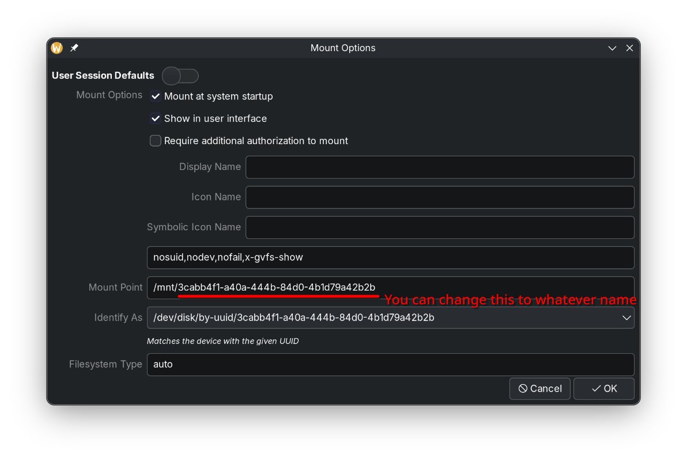

---
authors:
  - "@nicknamenamenick"
  - "@HikariKnight"
  - "@asen23"
  - "@TheScreechingBagel"
  - "@Zeglius"
tags:
  - Guide
---

<!-- ANCHOR: METADATA -->
<!--{"url_discourse": "https://universal-blue.discourse.group/docs?topic=970", "fetched_at": "2024-09-03 16:43:14.005694+00:00"}-->
<!-- ANCHOR_END: METADATA -->

!!! info "MicroSD cards automatically mount without any manual intervention required on Bazzite."

## Setup an auto-mounting partition

1. Open Gnome Disks, should have an icon like this. 

2. Wipe the partition you want to use, then use the leftover to create a new one.

   

3. Give it a name and a filesystem.

!!! warning "We only support BTRFS/ext4 filesystems"

{data-gallery="step-2"}
{data-gallery="step-2"}
{data-gallery="step-2"}

Now reboot, your partition should be mounted automatically. Should appear under `/run/media/system/PARTITION_NAME`.

{data-gallery="step-3"}

## Manual mounting

Append `,user,exec` at the end if doesnt work properly

## Troubleshooting

### Emergency Mode after mounting?

This video tutorial shows how to recover from your mounting mistakes.

https://www.youtube.com/watch?v=-2wca_0CpXY

### Drives will not auto-mount despite being BTRS/ext4 (Requests authentication every boot to mount)

1. Mount the target disk(s).

2. Open Gnome Disks and navigate to the target disk.

3. Click on Additional Partition Options > Edit Mount Options.

4. Ensure "User Session Defaults" is FALSE and "Mount at system startup" is TRUE the click "Ok"

5. Repeat for any additional disks. You can can confirm this worked by checking your Fstab file and seeing that the appropriate UUIDs have been added. `sudo cat /etc/fstab`

