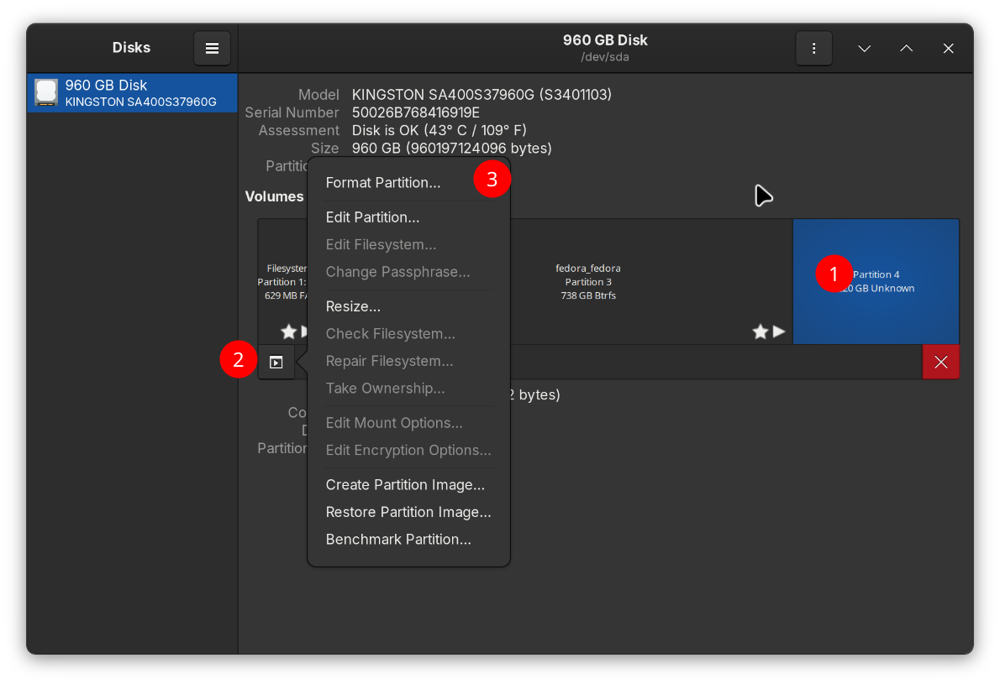
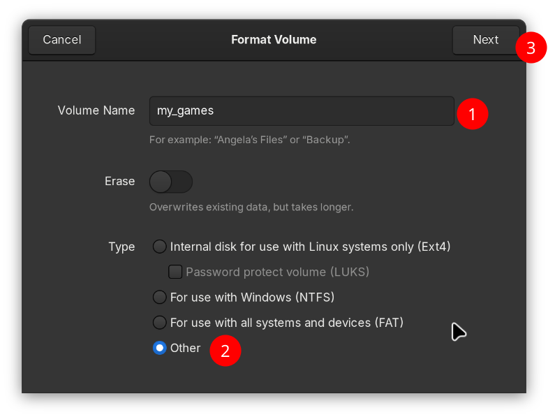
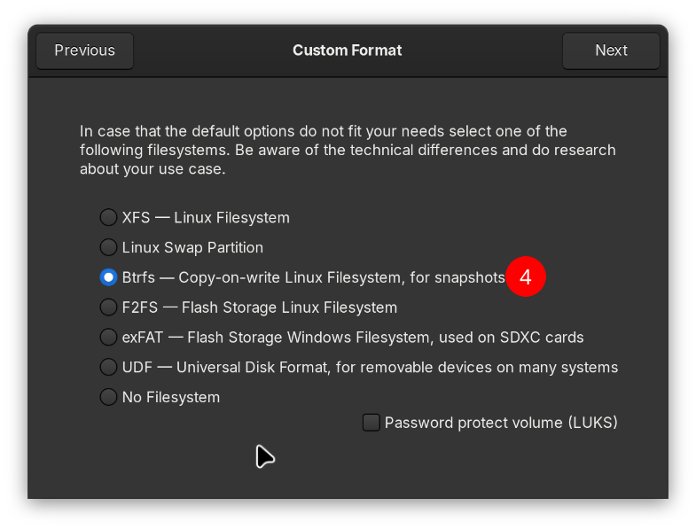
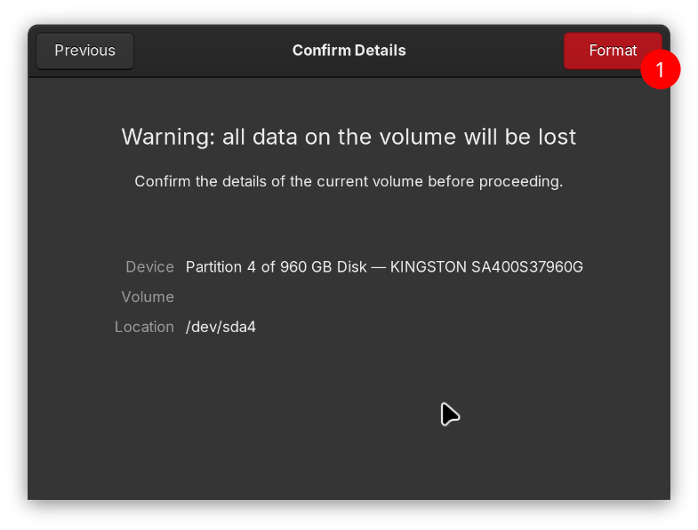
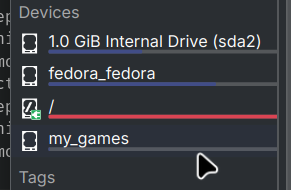
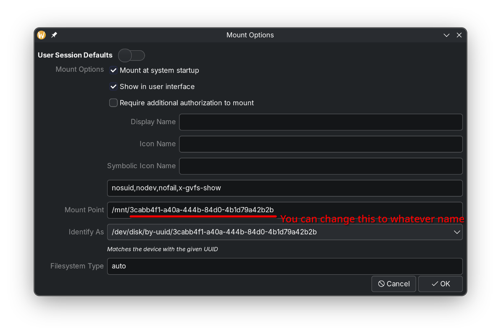
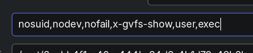

# 自动挂载外接硬盘

!!! info "MicroSD 卡一般不需要任何手动操作即可自动挂载。"

## 视频指南

https://youtu.be/fN9lvkkrExI

## 设置自动挂载的新分区

1. 启动**磁盘**程序；

2. 按需删除已有的分区，然后再可用空间里创建一个新分区；

   

3. 设置分区名称和文件系统（建议 BTRFS 或 Ext4）。

!!! warning "Bazzite 只接受 BTRFS 和 Ext4 文件系统自动挂载时出现的问题报告。"

{data-gallery="step-2"}
{data-gallery="step-2"}
{data-gallery="step-2"}

重新启动之后，新分区应该就会在`/run/media/system/[分区名]`目录下自动挂载。

{data-gallery="step-3"}

## 手动挂载

如果还是不行，可能需要在选项最后继续添加`,user,exec`。

## 故障排除

### 修改设置后启动时直接 Emergency Mode 了？

通常来讲这是挂载选项配置错误导致的。参考以下视频指南以进行恢复：

https://www.youtube.com/watch?v=-2wca_0CpXY

### BTRFS 或 ext4 仍无法自动挂载（启动时提示需要密码授权）

1. 手动挂载目标分区；

2. 启动**磁盘**程序并选择目标；

3. 点击设置图标 > 编辑挂载选项；

4. 确认“用户会话默认值”为**未勾选**，“系统启动时挂载”为勾选，然后选择“确定”；

5. 对所有受影响的分区重复同样的操作。处理完成后，`sudo cat /etc/fstab`的输出中应该会有每个目标分区对应的条目。
