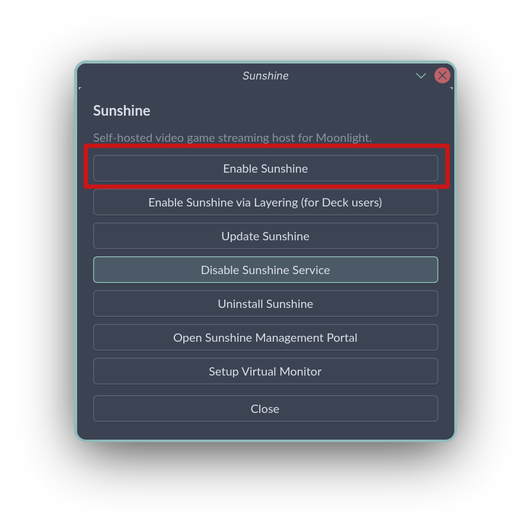

# 在 Bazzite 上配置 Sunshine

## Sunshine 和 Bazzite 的爱恨情仇说是

Sunshine 以前是集成进 Bazzite 镜像中的，但由于其很长一段时间没有提供 Fedora 43 和 44 的稳定包，导致 Bazzite 必须改用测试版的 Sunshine。又因为 Sunshine 测试版多次反复修改内部启动项文件的名称，导致 Bazzite 更新后 Sunshine 无法工作的情况多次出现。
将 Sunshine 从镜像中移除并单独管理使得它能够单独锁定到特定版本，这样便绕过了先前提到的问题。

目前推荐的配置 Sunshine 的方法是通过 **Bazzite Portal**，对应的是官方支持的 Flatpak 安装及相关配置。

!!! info "Sunshine 于 2026/05/16 终于发布了 F43 和 F44 的官方包，但 2026/04/29 的 Fedora 44 的更新中 Bazzite 已经从镜像中移除了 Sunshine 并转移至单独配置。"

## 我正在使用 Sunshine，需要做什么？

!!! notice "掌机版的用户请参考[这一部分](/Advanced/sunshine.md#setting-up-sunshine-on-deck-images)。"

以下指南通过 Bazzite Portal 的快捷命令帮助转换到 Flatpak 安装的 Sunshine。
!!! warning "强烈建议你确认能够物理访问目标设备，或配置好 SSH 连接。如果你只通过 Sunshine 连接，配置过程中连接可能会中断。"

1. 启动 Bazzite Portal，选择 **Sunshine**

2. 选择 **Enable**

3. 应该会弹出一个终端窗口以进行安装步骤。安装完成后，需要输入一次用户密码来授权录屏等相关权限。
4. 此时是个测试配置的好机会 - 先前安装时的配置应该会完整保留。

## Bazzite Portal 快捷安装的限制

Bazzite Portal 固定安装稳定版的 Sunshine Flatpak。如果你为了特定修复或其他原因需要测试版，则必须手动安装。
!!! info "Bazzite Portal 目前仍保留安装**实验性**的 Homebrew 版 Sunshine 的功能，用于掌机版的配置，但是目前该版本在录屏功能和系统通知栏指示器等方面存在已知问题。"

## 其他安装方式

Sunshine 官方通过 COPR 提供 Fedora 的安装包。除此之外也有其他的安装方法，但各自可能存在一些限制。
!!! warning "Bazzite 无法支持通过这些方式安装 Sunshine 的配置。如果发现问题，应直接报告到 Sunshine 或对应打包的项目下。"

=== "将官方 COPR 包添加到系统树"
    
    结果上类似于 Sunshine 仍在镜像内时的配置。
    使用以下命令将[官方版的稳定 COPR 包](https://copr.fedorainfracloud.org/coprs/lizardbyte/stable/)添加到系统树：
    ```bash
    sudo dnf5 copr enable lizardbyte/stable
    rpm-ostree install Sunshine
    ```
    !!! info "Sunshine 官方的打包往往不对应 Fedora 的大版本更新，因此在更新落地 Bazzite 后一段时间往往会出现没有对应包可供安装的情况，这会导致系统更新自动失败！此时必须通过`rpm-ostree reset`来重置系统树并恢复更新。"

=== "将社区 COPR 包添加到系统树"
    
    结果上类似于 Sunshine 仍在镜像内时的配置。
    和官方 COPR 包相比，社区包明确面向 Fedora 的更新频率，对上游 Breaking change 有专门处理，并且面向 Fedora 和 Bazzite 都有测试，以保证更新间的稳定性。

    使用以下命令将[社区维护的 COPR 包](https://copr.fedorainfracloud.org/coprs/pvermeer/sunshine/)添加到系统树：
    ```bash
    sudo dnf5 copr enable pvermeer/sunshine
    rpm-ostree install sunshine
    ```
    !!! info "社区包由 *pvermeer* 维护，Bazzite 无法提供支持。"
    
## 安装 Sunshine 测试版

Sunshine 测试版的 Flatpak 包不走已有的 Flatpak 仓库，因此必须手动配置，这会导致一些限制。
!!! notice "Bazzite 无法支持通过这些方式安装 Sunshine 测试版的配置。如果发现问题，应直接报告到 Sunshine 或对应打包的项目下。"

=== "手动安装测试版 Flatpak"

    Sunshine 测试版的 Flatpak 包不在 flathub-beta 等仓库中，因此只能从 [GitHub 的版本发布页面](https://github.com/LizardByte/Sunshine/releases)手动下载。
    1. 在你需要的版本下选择`Read more`；
    2. 找到`sunshine_x86_64.flatpak`（或你所需要的其他架构）并下载，文件应默认下载到`~/Downloads/`目录下。
    3. 运行以下命令：
    ```bash
    flatpak install --system ~/Downloads/sunshine_x86_64.flatpak
    flatpak run --command=additional-install.sh dev.lizardbyte.app.Sunshine
    systemctl --user enable --now app-dev.lizardbyte.app.Sunshine
    ```
    !!! info "之后每次更新版本，都需要重复这些步骤。"

=== "将官方 COPR 包添加到系统树"
    
    结果上类似于 Sunshine 仍在镜像内时的配置。
    使用以下命令将[官方的测试版 COPR 包](https://copr.fedorainfracloud.org/coprs/lizardbyte/beta/)添加到系统树：
    ```bash
    sudo dnf5 copr enable lizardbyte/beta
    rpm-ostree install Sunshine
    ```
    !!! warning "和稳定版一样，如果 Sunshine 官方没有提供新的 Fedora 大版本的安装包，则到时候 Bazzite 的系统更新会自动失败。此时必须通过`rpm-ostree reset`来重置系统树并恢复更新。"

=== "将社区 COPR 包添加到系统树"

    使用以下命令将[社区维护的测试版 COPR 包](https://copr.fedorainfracloud.org/coprs/pvermeer/sunshine/)添加到系统树：
    ```bash
    sudo dnf5 copr enable pvermeer/sunshine
    rpm-ostree install sunshine-beta
    ```
    !!! info "社区包由 *pvermeer* 维护，Bazzite 无法提供支持。"
    
=== "安装实验性的 Homebrew 包"

    该方法主要面向掌机版用户。
    在 Bazzite Portal 中选择 App Install 🡒 Sunshine 🡒 Enable Beta (Brew)。
    !!! notice "该安装方法仍在实验阶段，并且目前存在录屏功能和系统通知栏指示器等方面的已知问题。当前 Bazzite Portal 进行的配置下，系统通知栏图标默认隐藏，且采用 KMS 进行录屏。"
    
## 在掌机版镜像上配置 Sunshine

掌机版镜像下，**游戏模式**采用的是 Valve 的 Gamescope 微合成器，因此不支持基于 XDG Portal 或 Kwin Screencast 的录屏方式，所以只能使用 KMS 录屏。Flatpak 版的 Sunshine 目前无法支持 KMS，因此在游戏模式下必须使用其他方法安装 Sunshine 才能进行录屏。该限制不影响桌面模式。

=== "安装实验性的 Homebrew 包"

    在 Bazzite Portal 中选择 App Install 🡒 Sunshine 🡒 Enable Beta (Brew)。
    !!! notice "该安装方法仍在实验阶段，并且目前存在录屏功能和系统通知栏指示器等方面的已知问题。当前 Bazzite Portal 进行的配置下，系统通知栏图标默认隐藏，且采用 KMS 进行录屏。"
    
=== "将官方 COPR 包添加到系统树"
    
    结果上类似于 Sunshine 仍在镜像内时的配置。
    使用以下命令将[官方的 COPR 包](https://copr.fedorainfracloud.org/coprs/lizardbyte/stable/)添加到系统树：
    ```bash
    sudo dnf5 copr enable lizardbyte/stable
    rpm-ostree install Sunshine
    ```
    !!! warning "如果 Sunshine 官方没有提供新的 Fedora 大版本的安装包，则到时候 Bazzite 的系统更新会自动失败。此时必须通过`rpm-ostree reset`来重置系统树并恢复更新。"

=== "将社区 COPR 包添加到系统树"

    使用以下命令将[社区维护的 COPR 包](https://copr.fedorainfracloud.org/coprs/pvermeer/sunshine/)添加到系统树：
    ```bash
    sudo dnf5 copr enable pvermeer/sunshine
    rpm-ostree install sunshine
    ```
    !!! info "社区包由 *pvermeer* 维护，Bazzite 无法提供支持。"
    
## 安装方法比较

| 方法                         | Flatpak （Bazzite Portal）                    | Brew （Bazzite Portal）                         | 将官方 COPR 安装到系统树                         | 将社区 COPR 安装到系统树                         |
| :----------------------------: | :------------------------------------------ | :-------------------------------------------- | :------------------------------------------------ | :------------------------------------------------ |
| 是否不影响系统更新？   | ✅ 纯用户级安装                  | ✅ 纯用户级安装                    | ❌ 官方有鸽子前科       | ℹ️ 由 **pvermeer** 维护         |
| 能否锁定版本？ | ✅ 支持手动锁定                  | ✅ 默认锁定                  | ❌ `rpm-ostree` 限制[^1] | ❌ `rpm-ostree` 限制[^1] |
| 是否支持 KMS 录屏？    | ❌ Flatpak 不支持必要的 `setcap` 功能          | ℹ️ NVIDIA 可能存在问题                  | ✅ 无已知问题                                | ✅ 无已知问题                                |
| 版本是否稳定？                 | ✅ 默认安装稳定版                | ℹ️ 需要手动配置               | ❌ 官方有鸽子前科[^2]    | ✅ 社区维护的自动更新                 |
| 是否提供测试版？                   | ℹ️ 必须手动配置更新 | ✅ 默认为测试版，且锁定版本 | ℹ️ 自动更新，可能有 Breaking change        | ✅ 社区维护的自动更新                 |
| 支持状态            | ✅ 官方支持                      | ℹ️ 实验性，存在已知问题    | ❌ 官方有鸽子前科[^2]    | ✅ 社区维护的自动更新                 |

[^1]: 理论上可以手动从 COPR 下载特定版本的 RPM 包并人工加进系统树，但这样每次更新都必须手动卸载再重装。
[^2]: Sunshine 官方的 Fedora 包有过长期错过更新的情况（指没能赶上 Fedora 大版本更新时的 mass rebuild）。请参考[这一部分](/Advanced/sunshine/#what-is-happening-to-sunshine-on-bazzite)。

综合各方面考量，目前选择的配置是在桌面版默认 Flatpak 安装，而在掌机版采用测试版的 Homebrew 安装。

## 通过虚拟显示屏串流

请参考[自定义分辨率](/Advanced/custom_resolution/#guide-for-creating-a-custom-resolution-for-sunshine-game-streaming)相关指南。
    
## 常见问题

<hr>

### Is a display connected and turned on? (error 503)

该错误通常说明 Sunshine 在抓取屏幕时碰到问题。

=== "KWin ScreenCast"

    有些 KDE Plasma 和 Sunshine 的版本组合下，KWin ScreenCast 调用`zkde_screencast_unstable_v1`协议的权限定义存在问题。一个临时解决方法是定义`KWIN_WAYLAND_NO_PERMISSION_CHECKS=1`环境变量。[Bazzite Portal](/Installing_and_Managing_Software/Bazzite_Portal/) 下的 Install Applications → Setup Virtual Monitor → Fix Error 503 选项能够自动应用这一设置，或者在以下三处中任选一个进行设置：
    
    -   系统级设置：`/etc/environment.d/`
    -   用户级设置：`~/.config/environment.d/`（Bazzite Portal 会设置在这里）
    -   KDE Plasma 设置：`~/.config/plasma-workspace/env/kwin_vars.sh`
    
    !!! info "另外可以尝试在 KDE 系统设置 🡒 应用程序权限 🡒 Sunshine 下明确授权“远程控制”。"

=== "Kernel Mode Setting"
    
    !!! warning "由于 Flatpak 沙盒的限制，KMS 录屏在 Flatpak 版 Sunshine 下**无法正常运作**。"
    对于通过 Homebrew 安装的 Sunshine，这通常说明 Sunshine 的可执行文件没有调用 KMS 的权限。通过 Bazzite Portal 更新 Sunshine 通常能够解决该问题，或者手动运行`/usr/libexec/sunshine-postinst`这一安装后脚本。
    
=== "XDG Portal"

    可以尝试删除 Sunshine 有关远程控制和屏幕录制的授权记录。再次触发时，XDG Desktop Portal 应该会弹出新窗口再次请求授权。
    
=== "其他录屏方法"
    
    !!! warning "基于 X11 的录屏方法不受支持。目前支持的录屏方法都是通过桌面环境提供的合成器（Kwin 或 Mutter）或直接通过 KMS。"
    -   Bazzite 不支持纯 X11 的显示环境。
    -   NvFBC 面向 X11，因此同样不受支持。
    -   基于 wlroots 的 Wayland 合成器有一套单独的录屏协议，但目前 Bazzite 没有支持这些合成器的官方镜像。对于配置了这些合成器的自定义镜像，也许可以对应使用。

<hr>

### Error: Couldn't import RGB Image: 00003009 (error -1) 

在安装了 NVIDIA 显卡的系统上，`systemctl --user status homebrew.sunshine*`可能会报告错误`Error: Couldn't import RGB Image: 00003009`。
目前认为该错误是 Sunshine 和/或 CUDA 在 Homebrew 上的打包问题导致。一些可能的解决方法：

-    更新 Bazzite，并通过 Bazzite Portal 改为 Flatpak 版 Sunshine；
-    使用 **XDG Portal** 录屏时切换编码器；
-    如果可用，手动指定录屏使用的显卡；
-    通过其他安装方法改为使用测试版的 Sunshine。

!!! info "Sunshine 上游也在研究这个问题。如果你找到了解决方法，请积极向上报告。"

<hr>

### The \`brew link\` step did not complete successfully

这是 Homebrew 在 `/home` 为符号链接的 Linux 环境下的一个已知问题。
!!! info "建议通过 Bazzite Portal 切换到 Flatpak 版，不论是稳定版还是测试版。"

修复该问题需要手动创建 Homebrew 提示的**目标**文件夹，命令可能类似于：
`mkdir -p /home/linuxbrew/.linuxbrew/Cellar/xkeyboard-config/2.47/share/xkeyboard-config-2`
有些情况下强制重新`brew link`也能解决问题：
`brew unlink xkeyboard-config; brew link --overwrite xkeyboard-config`
    
如果有其他问题，欢迎来 [Bazzite 的 Discord 服务器](/community.md)讨论。
