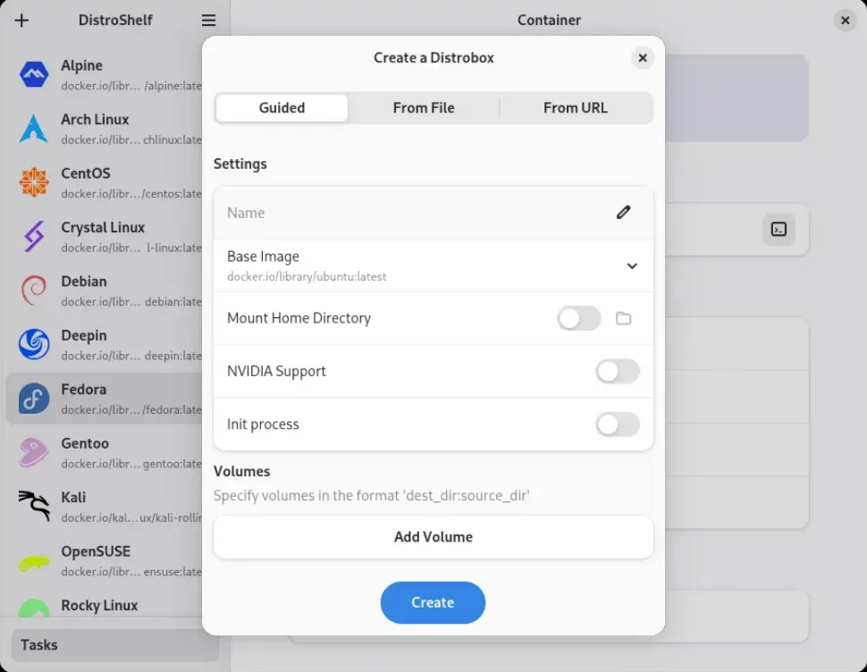

# Distrobox 容器


## 基本操作

在 Bazzite 上透過 Distrobox 容器運行其他 Linux 發行版，能在不會影響 Bazzite 系統本身的情況下使用其他包管理器和軟件源。

- 容器**不是**虛擬機
- 容器為可輕易拋棄及重建的
- 使用包管理器需要對傳統 Linux 系統管理有一定的認知
  - 你可以先創建一個測試容器去嘗試試鹹淡

Distrobox 容器基於運行其他 [Linux 發行版](https://distrobox.it/compatibility/#containers-distros)的子系統而運作。 你可以將一個容器作為開發環境或是安裝軟件的工具使用。

---

### **Linux 發行版例子**

!!! warning "請小心並批判性地安裝在社區包源如 AUR、COPR、與PPA上的軟件包。任何人都可以註冊並在這些包源上發行軟件，因而其質量及安全性參差不齊。"

| OS                                  | Package Manager    | Search for Packages                                                       |
| ----------------------------------- | ------------------ | ------------------------------------------------------------------------- |
| [Fedora][fedora]                    | [`dnf`][dnf]       | [Fedora Packages][fedora_pkgs] / [COPR Packages][copr]                    |
| [Arch][arch]                  | [`pacman`][pacman] | [Arch Linux Packages][arch_pkgs] / [AUR Packages][aur_pkgs]               |
| [Debian][debian] / [Ubuntu][ubuntu] | [`apt`][apt]       | [Debian Packages][deb_pkgs] / [Ubuntu Packages][ubuntu_pkgs] ([PPA][ppa]) |
| [openSUSE][osuse]                   | [`zypper`][zypper] | [openSUSE Packages][osuse_pkgs]                                           |
| [Void][void]                  | [`xbps`][xbps]     | [Void Linux Packages][void_pkgs]                                          |
| [Alpine][alpine]              | [`apk`][apk]       | [Alpine Linux Packages][alpine_pkgs]                                      |

---

#### Arch Linux Distrobox 容器例子


<small>_I use Arch (in a container) btw._</small>

---

## Distrobox 圖形界面



Distrobox containers can be created and managed graphically with [**DistroShelf**](https://github.com/ranfdev/DistroShelf) which is pre-installed.
你可以透過預安裝的 [**DistroShelf**(GNOME)](https://github.com/ranfdev/DistroShelf) 或 [**Kontainer**(KDE Plasma)](https://github.com/DenysMb/Kontainer) 創建及管理 Distrobox 容器。此外，你亦可如 Bazaar 應用商店中安裝它們。

---

## 命令行指令

你可於各種提供圖形介面的程式中創建及管理 Distrobox。當然，你亦可透過命令行指令進行更輕量化的管理和設置。

---

### 桌面集成功能

Applications with a graphical user interface can integrate with your system with an application shortcut by exporting the application using the below command in the container terminal window:

```bash
distrobox-export --app <package>
```
To "un-export" the app, enter the command below in the container terminal window:

```bash
distrobox-export --delete --app <package>
```

## Manually Create Pre-Configured Distrobox Containers

```command
ujust distrobox-assemble
```

Select the container that you want to use.

> **Advanced users**: Declare your own custom Distrobox containers following the [`distrobox-assemble` documentation](https://distrobox.it/usage/distrobox-assemble/).

### Entering The Container

Swap between different containers in your host with the terminal or alternatively **enter**:

```
distrobox enter <container>
```

## Removing Distrobox Containers

Delete containers graphically with DistroShelf.

Alternatively, use the command line:

```command
distrobox stop <container_name>
```

```commmand
distrobox rm -f <container_name>
```

## Distrobox Video Guide

https://youtu.be/5m0YfIiypwA

## Project Website

https://distrobox.it/

[fedora]: https://fedoraproject.org/
[dnf]: https://docs.fedoraproject.org/en-US/quick-docs/dnf/
[fedora_pkgs]: https://packages.fedoraproject.org/index-static.html
[copr]: https://copr.fedorainfracloud.org/
[arch]: https://archlinux.org/
[pacman]: https://wiki.archlinux.org/title/Pacman
[arch_pkgs]: https://archlinux.org/packages/
[aur_pkgs]: https://aur.archlinux.org/packages?SB=l&SO=d
[debian]: https://www.debian.org/
[ubuntu]: https://ubuntu.com/
[apt]: https://ubuntu.com/server/docs/package-management
[deb_pkgs]: https://packages.debian.org/stable/
[ubuntu_pkgs]: https://packages.ubuntu.com/
[ppa]: https://launchpad.net/ubuntu/+ppas
[osuse]: https://get.opensuse.org/
[zypper]: https://documentation.suse.com/smart/systems-management/html/concept-zypper/index.html
[osuse_pkgs]: https://search.opensuse.org/packages/
[void]: https://voidlinux.org/
[xbps]: https://docs.voidlinux.org/xbps/index.html
[void_pkgs]: https://voidlinux.org/packages/
[alpine]: https://www.alpinelinux.org/
[apk]: https://wiki.alpinelinux.org/wiki/Alpine_Package_Keeper
[alpine_pkgs]: https://pkgs.alpinelinux.org/packages
